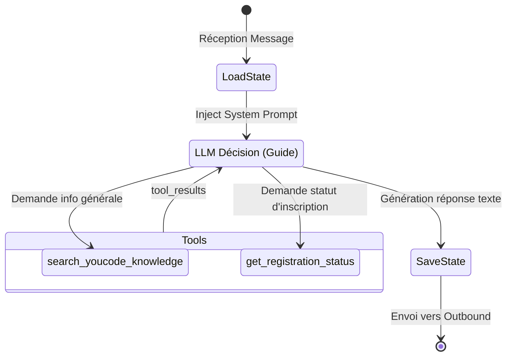
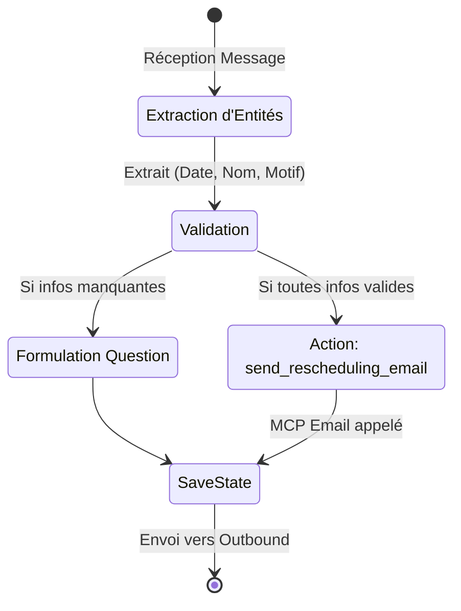
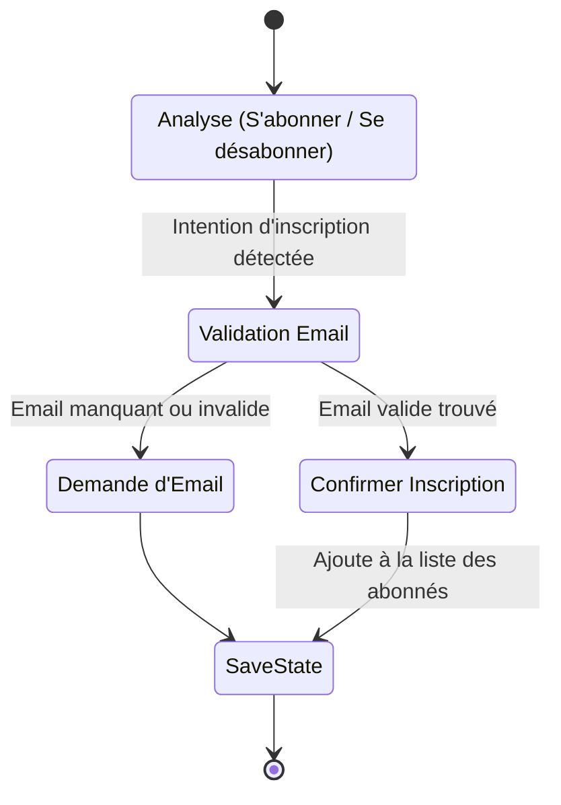
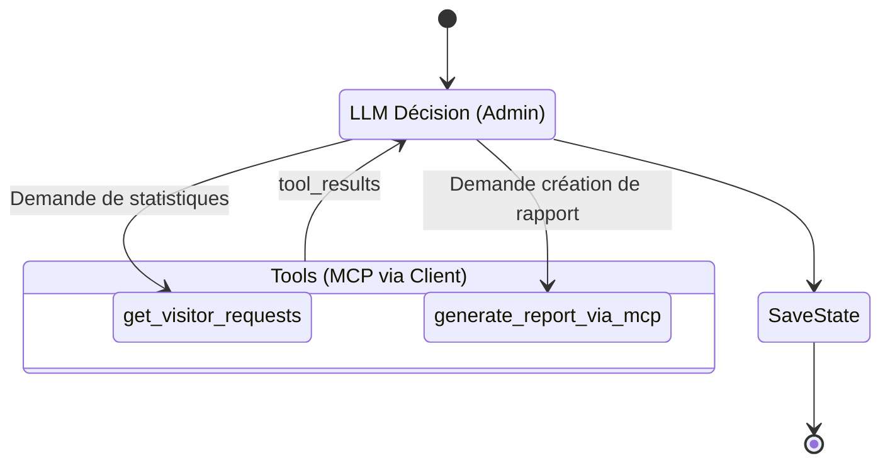
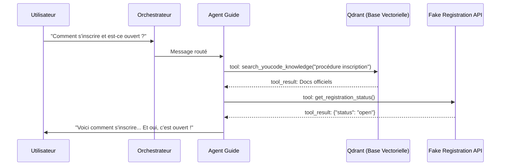
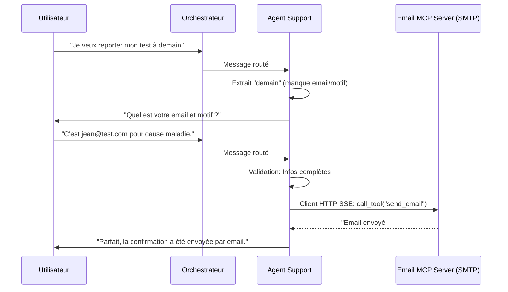
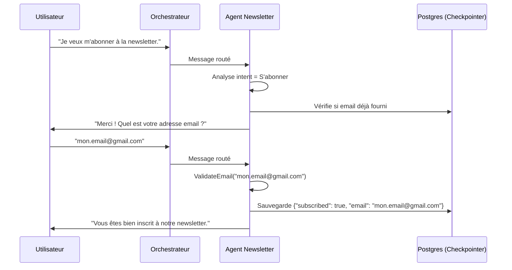
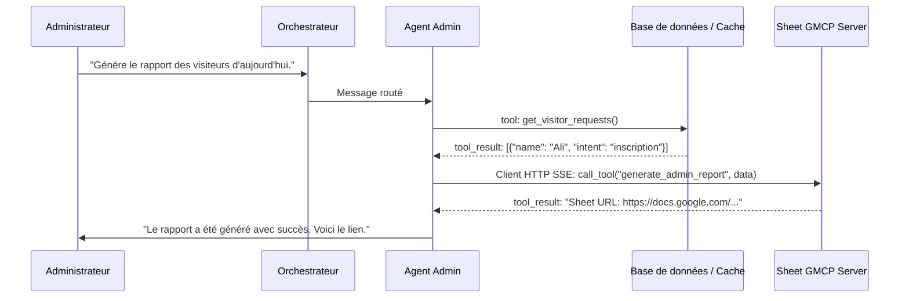

# Architecture Globale : YouCode AI Platform

Ces diagrammes expliquent le cycle de vie complet d'un message, avec des vues détaillées du fonctionnement interne et des interactions de **chaque agent**.

---

## 1. Flux Principal et Communication (RabbitMQ)
*Le cycle de vie complet d'un message, numéroté étape par étape.*

```mermaid
graph TD
    %% Utilisateurs et Interfaces
    UserWA((Utilisateur\nWhatsApp))
    UserDiscord((Utilisateur\nDiscord))
    EvoAPI[Evolution API]
    DiscordAPI[API Discord]

    %% Gateways
    WA_Gateway[WhatsApp Gateway]
    Discord_Gateway[Discord Gateway]

    %% RabbitMQ Queues
    Q_Incoming[(Queue:\nincoming_messages)]
    Q_Outbound[(Queue:\noutbound_messages)]
    
    Q_Guide[(Queue: guide_requests)]
    Q_Support[(Queue: support_requests)]
    Q_News[(Queue: newsletter_requests)]
    Q_Admin[(Queue: admin_requests)]

    %% Orchestrator
    Orchestrator{Orchestrateur\nSuperviseur LLM}
    Guardrail[Guardrail Service\n(Profanity + Qdrant)]

    %% Agents (Consommateurs)
    AgentGuide[Agent Guide]
    AgentSupport[Agent Support]
    AgentNews[Agent Newsletter]
    AgentAdmin[Agent Admin]

    %% Flux
    UserWA -->|(1) Message| EvoAPI
    UserDiscord -->|(1) Message| DiscordAPI
    
    EvoAPI -->|(2) Webhook| WA_Gateway
    DiscordAPI -->|(2) Websocket| Discord_Gateway

    WA_Gateway -->|(3) Publie| Q_Incoming
    Discord_Gateway -->|(3) Publie| Q_Incoming
    
    Q_Incoming -->|(4) Consomme| Orchestrator
    Orchestrator <-->|(5) Vérifie Sécurité| Guardrail

    Orchestrator -->|(6) Route: Intent| Q_Guide
    Orchestrator -->|(6) Route: Intent| Q_Support
    Orchestrator -->|(6) Route: Intent| Q_News
    Orchestrator -->|(6) Route: Intent| Q_Admin

    Q_Guide -->|(7) Consomme| AgentGuide
    Q_Support -->|(7) Consomme| AgentSupport
    Q_News -->|(7) Consomme| AgentNews
    Q_Admin -->|(7) Consomme| AgentAdmin

    AgentGuide -->|(8) Publie Réponse| Q_Outbound
    AgentSupport -->|(8) Publie Réponse| Q_Outbound
    AgentNews -->|(8) Publie Réponse| Q_Outbound
    AgentAdmin -->|(8) Publie Réponse| Q_Outbound

    Q_Outbound -->|(9) Consomme (source=whatsapp)| WA_Gateway
    Q_Outbound -->|(9) Consomme (source=discord)| Discord_Gateway

    WA_Gateway -->|(10) POST Reply| EvoAPI
    Discord_Gateway -->|(10) API Call| DiscordAPI
    
    EvoAPI -->|(11) Message| UserWA
    DiscordAPI -->|(11) Message| UserDiscord
```

---

## 2. Graphes Cognitifs par Agent (LangGraph)

Chaque agent possède sa propre logique métier. Voici comment fonctionne la boucle `ReAct` (ou le State Machine) de chacun d'eux.

### A. Agent Guide (RAG & Info)


### B. Agent Support (Prise de Rendez-vous / Dépannage)


### C. Agent Newsletter (Collecte d'Abonnés)


### D. Agent Admin (Gestion & Reporting via MCP)


---

## 3. Séquences de Communication et d'Outils (Interactions)

Voici comment chaque agent interagit concrètement avec ses outils, APIs ou serveurs MCP.

### A. Séquence : Agent Guide
L'Agent Guide utilise des outils internes (non-MCP).



### B. Séquence : Agent Support
L'Agent Support extrait des entités et déclenche un envoi d'email via un serveur MCP externe.



### C. Séquence : Agent Newsletter
L'Agent Newsletter est principalement conversationnel et gère un état interne.



### D. Séquence : Agent Admin
L'Agent Admin interagit avec le monde extérieur exclusivement via des serveurs MCP (Model Context Protocol).


