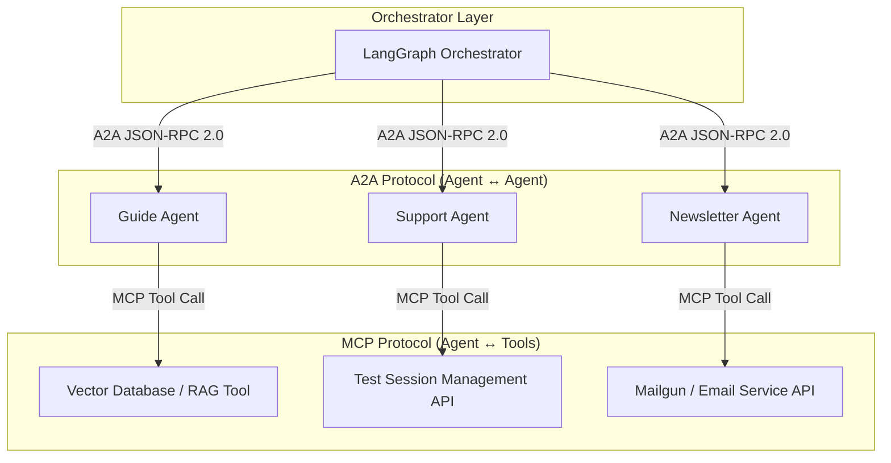

# YouCode AI — Agent-to-Agent (A2A) Protocol Specification

## Table of Contents
1. [What is A2A?](#1-what-is-a2a)
2. [Why A2A for YouCode AI?](#2-why-a2a-for-youcode-ai)
3. [Agent Cards](#3-agent-cards)
4. [Request Format (Orchestrator → Agent)](#4-request-format-orchestrator--agent)
5. [Response Format (Agent → Orchestrator)](#5-response-format-agent--orchestrator)
6. [Error Codes](#6-error-codes)
7. [Implementation in FastAPI](#7-implementation-in-fastapi)

---

## 1. What is A2A?

The **Agent-to-Agent (A2A)** protocol is an open, standardized communication protocol originally developed by Google and now hosted under the **Linux Foundation**. It defines how autonomous artificial intelligence agents discover each other, negotiate capabilities, delegate subtasks, and exchange context across organizational and technical boundaries.

### Technical Foundations
* **Transport:** Standard HTTP / HTTPS endpoints.
* **Message Framing:** JSON-RPC 2.0 over HTTP `POST` requests.
* **Streaming & Real-Time updates:** Server-Sent Events (SSE) for long-running or streaming task status updates.
* **Interoperability:** Framework-agnostic JSON schema interface allowing disparate agent systems (LangGraph, CrewAI, AutoGen, custom FastAPI microservices) to interoperate seamlessly.

### A2A vs. MCP (Model Context Protocol)

A2A operates at a higher level of abstraction than tool-invocation protocols like Anthropic's **Model Context Protocol (MCP)**. The two protocols are complementary:

| Feature | Model Context Protocol (MCP) | Agent-to-Agent Protocol (A2A) |
| :--- | :--- | :--- |
| **Primary Relationship** | Agent $\leftrightarrow$ Tool / Context Source | Agent $\leftrightarrow$ Agent |
| **Scope** | Accessing local files, executing database queries, running DevTools | Delegating multi-step workflows, task distribution, context sharing |
| **Abstractions** | Prompts, Resources, Tools | Tasks, Messages, Agent Cards, Artifacts |
| **Statefulness** | Stateless tool calls | Stateful task progression and multi-turn sub-dialogues |



---

## 2. Why A2A for YouCode AI?

In YouCode AI, complex user interactions (ranging from admissions guidance to test rescheduling and newsletter subscriptions) require dynamic orchestration among specialized domain agents. Adopting the A2A standard provides several key benefits:

1. **Standardized Serialization & Payloads:** Standardizing on JSON-RPC 2.0 eliminates custom HTTP request/response schemas for each agent service, reducing contract drift and repetitive parsing code.
2. **Framework-Agnostic Integration:** Agents can be written in any language or framework (FastAPI Python, CrewAI, AutoGen, Node.js). The Orchestrator interacts with them purely via standard A2A JSON-RPC HTTP interfaces.
3. **Structured Error Handling:** Standardized error codes and clear application-level error boundaries allow the orchestrator to make deterministic fallback, retry, or routing decisions.
4. **Dynamic Capability Discovery:** Agent Cards (`/.well-known/agent.json`) allow the orchestrator to dynamically register agents, query supported skills, and inspect capability manifests without hardcoding endpoints in application logic.

---

## 3. Agent Cards

Every A2A-compliant agent exposes a JSON descriptor at `GET /.well-known/agent.json`. This Agent Card informs clients and orchestrators about the agent's identity, endpoints, capability flags, and supported skills.

### Agent Card Schema Fields
* `name` *(string)*: Unique human-readable agent identifier.
* `description` *(string)*: Overview of the agent's responsibilities.
* `url` *(string)*: Base HTTP URL of the agent service.
* `version` *(string)*: Semantic versioning string (e.g., `"1.0.0"`).
* `capabilities` *(object)*: Feature flags (`streaming: false`, `pushNotifications: false`).
* `skills` *(array)*: List of skill descriptors, each containing `id`, `name`, and `description`.

### 3.1 Guide Agent Card Example
```json
{
  "name": "Guide Agent",
  "description": "Provides pedagogical assistance, program information, admission rules, and campus guidance for YouCode candidates.",
  "url": "http://guide-agent:8001",
  "version": "1.0.0",
  "capabilities": {
    "streaming": false,
    "pushNotifications": false
  },
  "skills": [
    {
      "id": "answer_question",
      "name": "Answer Academic and Campus Questions",
      "description": "Answers questions regarding YouCode programs, admission criteria, pedagogy, and campus locations using RAG."
    }
  ]
}
```

### 3.2 Support Agent Card Example
```json
{
  "name": "Support Agent",
  "description": "Handles candidate support tickets, issue escalation, and test session rescheduling.",
  "url": "http://support-agent:8002",
  "version": "1.0.0",
  "capabilities": {
    "streaming": false,
    "pushNotifications": false
  },
  "skills": [
    {
      "id": "reschedule_test",
      "name": "Reschedule Entrance Test",
      "description": "Modifies, moves, or reschedules candidate orientation and entrance test sessions."
    },
    {
      "id": "general_support",
      "name": "General Candidate Support",
      "description": "Processes candidate help requests, updates profile contact data, and answers support queries."
    }
  ]
}
```

### 3.3 Newsletter Agent Card Example
```json
{
  "name": "Newsletter Agent",
  "description": "Manages subscriptions, topics, and mailing preferences for YouCode news and campus updates.",
  "url": "http://newsletter-agent:8003",
  "version": "1.0.0",
  "capabilities": {
    "streaming": false,
    "pushNotifications": false
  },
  "skills": [
    {
      "id": "subscribe",
      "name": "Subscribe User to Newsletter",
      "description": "Subscribes a candidate or user email address to specified news topics or event digests."
    },
    {
      "id": "unsubscribe",
      "name": "Unsubscribe User from Newsletter",
      "description": "Removes a user email address from YouCode newsletter broadcast lists."
    }
  ]
}
```

---

## 4. Request Format (Orchestrator → Agent)

When the Orchestrator delegates a task to an agent, it sends an HTTP `POST` request to the agent's endpoint with method `tasks/send`.

### Complete JSON Request Example
```json
{
  "jsonrpc": "2.0",
  "method": "tasks/send",
  "params": {
    "id": "task-550e8400-e29b-41d4-a716-446655440000",
    "message": {
      "role": "user",
      "parts": [
        {
          "type": "text",
          "text": "I need to reschedule my entrance test scheduled for tomorrow."
        }
      ]
    },
    "metadata": {
      "thread_id": "support_user123",
      "user_id": "user123",
      "context_summary": "User is registered for candidate entrance test on 2026-07-27."
    }
  },
  "id": "rpc-1"
}
```

### Field Explanations

| Field | Type | Description |
| :--- | :--- | :--- |
| `jsonrpc` | `string` | Must be exactly `"2.0"`. Identifies the protocol version. |
| `method` | `string` | The RPC procedure to invoke. For task execution, this is `"tasks/send"`. |
| `params` | `object` | Named container for task arguments. |
| `params.id` | `string` | Unique UUID representing the delegated task session. |
| `params.message` | `object` | Contextual message object with `role` (`"user"`, `"agent"`, or `"system"`) and `parts`. |
| `params.message.parts` | `array` | Polymorphic message content elements (e.g. text segments, structured payloads). |
| `params.metadata` | `object` | Session metadata passed from Orchestrator (e.g. `thread_id`, `user_id`, `context_summary`). |
| `id` | `string \| number` | Correlation identifier for matching the HTTP JSON-RPC request and response pair. |

---

## 5. Response Format (Agent → Orchestrator)

The target agent returns a JSON-RPC 2.0 response object containing either a `result` payload (on success) or an `error` payload (on failure).

### 5.1 Success Response Example
```json
{
  "jsonrpc": "2.0",
  "result": {
    "id": "task-550e8400-e29b-41d4-a716-446655440000",
    "status": {
      "state": "completed",
      "updated_at": "2026-07-26T18:23:44Z"
    },
    "message": {
      "role": "agent",
      "parts": [
        {
          "type": "text",
          "text": "Your entrance test has been successfully rescheduled to August 3, 2026 at 10:00 AM."
        }
      ]
    },
    "artifacts": [
      {
        "name": "reschedule_confirmation",
        "type": "application/json",
        "data": {
          "booking_id": "BK-99214",
          "new_date": "2026-08-03T10:00:00Z"
        }
      }
    ],
    "metadata": {
      "agent_name": "support_agent",
      "execution_time_ms": 340
    }
  },
  "id": "rpc-1"
}
```

* **`status.state`**: Task execution state (`"completed"`, `"working"`, `"failed"`, `"input_required"`).
* **`artifacts`**: Structured data objects generated by the agent during task execution.
* **`metadata`**: Diagnostic and telemetry metrics (execution time, agent instance details).

### 5.2 Error Response Example
```json
{
  "jsonrpc": "2.0",
  "error": {
    "code": -32002,
    "message": "Agent unavailable: downstream test session service unreachable",
    "data": {
      "agent_id": "support-agent",
      "retry_after_seconds": 15
    }
  },
  "id": "rpc-1"
}
```

---

## 6. Error Codes

A2A utilizes standard JSON-RPC 2.0 error codes alongside custom application-level error definitions reserved in the range `-32000` to `-32099`.

| Code | Name | Description |
| :--- | :--- | :--- |
| `-32600` | **Invalid Request** | The JSON payload sent is not a valid JSON-RPC 2.0 request (missing `jsonrpc`, `method`, or malformed structure). |
| `-32601` | **Method not found** | The requested RPC method does not exist or is not supported by the agent (e.g. unknown method string). |
| `-32603` | **Internal error** | Internal agent processing error during task execution (e.g. unhandled exceptions, database failures). |
| `-32001` | **Rate limit exceeded** | Custom application error indicating that request quotas or rate limits for the agent have been exceeded. |
| `-32002` | **Agent unavailable** | Custom application error indicating that the target agent or its required downstream dependencies are offline or unreachable. |

---

## 7. Implementation in FastAPI

Below is a complete reference implementation demonstrating how to build A2A Pydantic models, a FastAPI receiving endpoint, and an asynchronous HTTP client in Python.

### Python Code Implementation

```python
"""
A2A (Agent-to-Agent) Protocol Implementation in FastAPI.
Includes Pydantic v2 schemas, server-side route handler, and HTTP client.
"""

from typing import Any, Dict, List, Literal, Optional, Union
from fastapi import FastAPI, HTTPException, status
import httpx
from pydantic import BaseModel, Field


# ============================================================================
# 1. Pydantic Models (Schemas)
# ============================================================================

class A2APart(BaseModel):
    """Represents a part of a message (text or structured data)."""
    type: str = Field(default="text", description="Part type e.g. 'text' or 'data'")
    text: Optional[str] = Field(default=None, description="Textual content if type=='text'")
    data: Optional[Dict[str, Any]] = Field(default=None, description="Structured data payload")


class A2AMessage(BaseModel):
    """Represents a message passed within an A2A task."""
    role: str = Field(description="Role of the sender: 'user', 'agent', or 'system'")
    parts: List[A2APart] = Field(default_factory=list, description="Array of message parts")


class A2ATaskParams(BaseModel):
    """Task parameters sent from Orchestrator to Agent."""
    id: str = Field(description="Unique task UUID")
    message: A2AMessage = Field(description="Current message payload")
    metadata: Dict[str, Any] = Field(default_factory=dict, description="Session and context metadata")


class A2ARequest(BaseModel):
    """JSON-RPC 2.0 Request wrapper."""
    jsonrpc: Literal["2.0"] = "2.0"
    method: str = Field(description="RPC method name, e.g., 'tasks/send'")
    params: A2ATaskParams = Field(description="Task payload parameters")
    id: Union[str, int] = Field(description="Request correlation ID")


class A2AStatus(BaseModel):
    """Status details of a task execution."""
    state: str = Field(description="Task state: 'completed', 'working', 'failed', 'input_required'")
    updated_at: Optional[str] = Field(default=None, description="ISO timestamp of last update")


class A2AArtifact(BaseModel):
    """Artifact generated by an agent during execution."""
    name: str = Field(description="Artifact name identifier")
    type: str = Field(description="MIME type or custom data type")
    data: Dict[str, Any] = Field(default_factory=dict, description="Artifact content data")


class A2ATaskResult(BaseModel):
    """Result payload returned by an agent on success."""
    id: str = Field(description="Task UUID")
    status: A2AStatus = Field(description="Current task status")
    message: A2AMessage = Field(description="Agent response message")
    artifacts: List[A2AArtifact] = Field(default_factory=list, description="Generated artifacts")
    metadata: Dict[str, Any] = Field(default_factory=dict, description="Execution metadata")


class A2AError(BaseModel):
    """JSON-RPC 2.0 Error details."""
    code: int = Field(description="Numeric error code")
    message: str = Field(description="Human readable error message")
    data: Optional[Dict[str, Any]] = Field(default=None, description="Additional error context")


class A2AResponse(BaseModel):
    """JSON-RPC 2.0 Response wrapper."""
    jsonrpc: Literal["2.0"] = "2.0"
    result: Optional[A2ATaskResult] = Field(default=None, description="Result payload on success")
    error: Optional[A2AError] = Field(default=None, description="Error object on failure")
    id: Optional[Union[str, int]] = Field(default=None, description="Correlated request ID")


# ============================================================================
# 2. FastAPI Route Implementation (Agent Service Side)
# ============================================================================

app = FastAPI(title="A2A Agent Service", version="1.0.0")


@app.post("/a2a/v1", response_model=A2AResponse)
async def receive_a2a_request(request: A2ARequest) -> A2AResponse:
    """
    Receives and processes incoming A2A JSON-RPC 2.0 requests.
    """
    # 1. Validate Method
    if request.method != "tasks/send":
        return A2AResponse(
            id=request.id,
            error=A2AError(
                code=-32601,
                message=f"Method '{request.method}' not found",
                data={"supported_methods": ["tasks/send"]}
            )
        )

    try:
        # Extract user prompt from parts
        user_text = ""
        for part in request.params.message.parts:
            if part.type == "text" and part.text:
                user_text += part.text + " "
        user_text = user_text.strip()

        # Simulated business logic (e.g. process support ticket or RAG search)
        response_text = f"Agent processed request: '{user_text}'"

        return A2AResponse(
            id=request.id,
            result=A2ATaskResult(
                id=request.params.id,
                status=A2AStatus(state="completed", updated_at="2026-07-26T18:23:44Z"),
                message=A2AMessage(
                    role="agent",
                    parts=[A2APart(type="text", text=response_text)]
                ),
                artifacts=[
                    A2AArtifact(
                        name="process_summary",
                        type="application/json",
                        data={"processed": True, "task_id": request.params.id}
                    )
                ],
                metadata={"agent_name": "support_agent", "execution_time_ms": 120}
            )
        )

    except Exception as exc:
        return A2AResponse(
            id=request.id,
            error=A2AError(
                code=-32603,
                message=f"Internal agent error: {str(exc)}"
            )
        )


# ============================================================================
# 3. HTTPX Asynchronous Client (Orchestrator Side)
# ============================================================================

class A2AClient:
    """Asynchronous client for sending A2A requests to downstream agents."""

    def __init__(self, timeout_seconds: float = 30.0):
        self.timeout = timeout_seconds

    async def send_task(
        self,
        agent_endpoint_url: str,
        task_id: str,
        prompt: str,
        metadata: Optional[Dict[str, Any]] = None,
        rpc_id: Union[str, int] = "rpc-1"
    ) -> A2AResponse:
        """
        Sends an A2A task delegation request to a target agent endpoint.
        """
        request_payload = A2ARequest(
            jsonrpc="2.0",
            method="tasks/send",
            params=A2ATaskParams(
                id=task_id,
                message=A2AMessage(
                    role="user",
                    parts=[A2APart(type="text", text=prompt)]
                ),
                metadata=metadata or {}
            ),
            id=rpc_id
        )

        async with httpx.AsyncClient(timeout=self.timeout) as client:
            try:
                response = await client.post(
                    agent_endpoint_url,
                    json=request_payload.model_dump(),
                    headers={"Content-Type": "application/json"}
                )
                response.raise_for_status()
                return A2AResponse.model_validate(response.json())

            except httpx.HTTPStatusError as err:
                return A2AResponse(
                    id=rpc_id,
                    error=A2AError(
                        code=-32002,
                        message=f"Agent HTTP error: {err.response.status_code} - {err.response.text}"
                    )
                )
            except httpx.RequestError as err:
                return A2AResponse(
                    id=rpc_id,
                    error=A2AError(
                        code=-32002,
                        message=f"Agent network connection failed: {str(err)}"
                    )
                )
```
