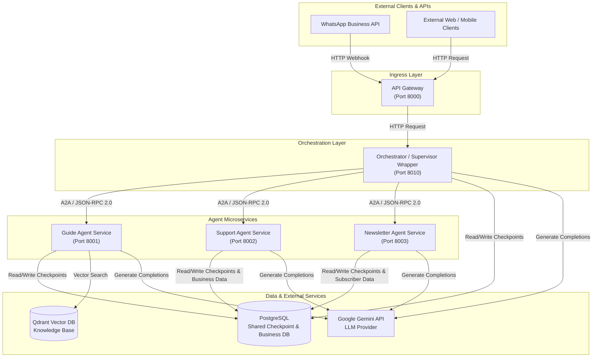

# YouCode AI Architecture Overview

This document provides a comprehensive architecture overview of **YouCode AI**, the multi-agent conversational AI system designed for **YouCode Maroc** (a coding school in Morocco). It outlines the system architecture, target microservices design, individual service responsibilities, key technical decisions, and monorepo repository structure.

---

## 1. System Overview

**YouCode AI** is a multi-agent conversational assistant built with [LangGraph](https://github.com/langchain-ai/langgraph) and powered by Google Gemini LLMs. It handles interactions across multiple domains for visitors, applicants, and students of YouCode Maroc.

### Current State vs. Target State
- **Current State (Monolithic):** The initial implementation operates as a single FastAPI process utilizing an in-memory or SQLite checkpointer with a single shared `YouCodeState` dictionary. While effective for early prototyping, this monolithic structure introduces tight coupling, single-point-of-failure risks, state leakage across agent domains, and an inability to scale individual agents independently.
- **Target State (Microservices Architecture):** The system is migrating to a decoupled microservices architecture. Each agent domain is encapsulated in an independent microservice communicating over a standardized Agent-to-Agent (A2A) protocol (JSON-RPC 2.0 over HTTP). Conversation state and checkpoints are persisted in a centralized PostgreSQL database with thread isolation per agent domain.

### Domain Agents
The system consists of four primary agents:
1. **Supervisor (Orchestrator):** Analyzes incoming user messages, determines intent, routes requests to appropriate domain agents, and aggregates responses.
2. **Guide Agent (RAG Q&A):** Answers visitor queries regarding YouCode programs, admissions, selection pools (*piscines*), campus rules, and educational methodology using Retrieval-Augmented Generation (RAG) backed by a Qdrant vector database.
3. **Support Agent:** Manages administrative requests such as admission test rescheduling, ticket creation, and candidate status inquiries.
4. **Newsletter Agent:** Manages user subscription opt-ins, preferences, and unsubscriptions.

---

## 2. Target Architecture

The microservices architecture separates ingress request handling, supervisor orchestration, specialized domain agent execution, vector retrieval, and state persistence.

### System Architecture Diagram



---

## 3. Service Descriptions

### 1. API Gateway Service
- **Port:** `8000`
- **Responsibilities:**
  - Serves as the single ingress entry point for WhatsApp Business API webhooks and external web/mobile client applications.
  - Validates webhook security signatures (e.g. Meta HMAC signature verification) and sanitizes request payloads.
  - Enforces rate limiting, CORS policies, and request payload validation.
  - Normalizes external incoming payloads into standard internal message event structures.
  - Routes sanitized incoming requests to the Orchestrator service.
- **Dependencies:** Orchestrator Service (`http://orchestrator:8010`).
- **State Managed:** Stateless (transient request forwarding and session header propagation).

### 2. Orchestrator Service
- **Port:** `8010`
- **Responsibilities:**
  - Runs the Supervisor agent logic compiled with LangGraph to orchestrate conversation flows.
  - Analyzes context and user intent to route messages to the appropriate downstream agent services.
  - Communicates with Agent microservices using JSON-RPC 2.0 (A2A protocol) via asynchronous HTTP client (`httpx`).
  - Aggregates sub-agent responses and constructs final responses returned to the Gateway.
  - Implements retry policies and fallback logic when downstream agent microservices are unavailable.
- **Dependencies:** PostgreSQL (checkpoint store), Google Gemini API (LLM provider), Guide Service (8001), Support Service (8002), Newsletter Service (8003).
- **State Managed:** `SupervisorState` / Orchestrator Thread State (persisted asynchronously in PostgreSQL using `AsyncPostgresSaver` under orchestrator-scoped thread IDs).

### 3. Guide Agent Service
- **Port:** `8001`
- **Responsibilities:**
  - Handles informational Q&A regarding YouCode Maroc (admissions, programs, campus life, selection pools).
  - Performs vector similarity searches against Qdrant collections containing knowledge base documents.
  - Augments system prompts with relevant context chunks and synthesizes answers using Google Gemini API.
  - Maintains domain-specific conversation history for guide interactions.
- **Dependencies:** Qdrant Vector DB, PostgreSQL (checkpoint store), Google Gemini API.
- **State Managed:** `GuideState` (persisted in PostgreSQL using `AsyncPostgresSaver` under guide-scoped thread IDs).

### 4. Support Agent Service
- **Port:** `8002`
- **Responsibilities:**
  - Processes administrative candidate requests such as admission test rescheduling and ticket creation.
  - Validates candidate credentials, reference numbers, and test schedules against PostgreSQL business tables.
  - Executes database mutations to record schedule updates and administrative audit logs.
  - Formats confirmation and status responses for candidates.
- **Dependencies:** PostgreSQL (business relational database and checkpoint store), Google Gemini API.
- **State Managed:** `SupportState` (persisted in PostgreSQL using `AsyncPostgresSaver` under support-scoped thread IDs).

### 5. Newsletter Agent Service
- **Port:** `8003`
- **Responsibilities:**
  - Manages subscriber registrations, email format verification, and unsubscriptions for YouCode news.
  - Reads and updates subscriber records and interaction logs in PostgreSQL.
  - Handles subscription state logic (e.g. active, pending, unsubscribed).
  - Generates confirmation and status update messages for users.
- **Dependencies:** PostgreSQL (business relational database and checkpoint store), Google Gemini API.
- **State Managed:** `NewsletterState` (persisted in PostgreSQL using `AsyncPostgresSaver` under newsletter-scoped thread IDs).

---

## 4. Key Design Decisions

The architectural design choices for YouCode AI prioritize developer velocity, operational simplicity, cost optimization, and open standards:

| Decision | Choice | Alternatives Rejected | Justification |
| :--- | :--- | :--- | :--- |
| **Inter-Service Communication** | **A2A Protocol (JSON-RPC 2.0)** | gRPC, Kafka | JSON-RPC 2.0 over HTTP provides a lightweight, human-readable, standard protocol ideal for synchronous multi-agent request-response flows. gRPC introduces unnecessary schema compilation overhead (Protobuf), while Kafka is overkill for low-latency synchronous chat loops. |
| **Agent Microservice Exposure** | **FastAPI** | LangServe, LangGraph Platform | FastAPI provides asynchronous high performance, native Pydantic data validation, OpenAPI specification generation, and complete framework autonomy without relying on deprecated libraries (LangServe) or paid proprietary platforms. |
| **Checkpoint Persistence** | **AsyncPostgresSaver** | SQLite, Redis | PostgreSQL provides durable, ACID-compliant multi-process checkpointing capable of handling high concurrent write volumes across services. SQLite lacks concurrent write support across microservices, while pure Redis introduces data volatility risks. |
| **State Isolation** | **Separate `thread_id` per Agent** | Shared Unified State | Allocating distinct `thread_id` namespaces per agent service (e.g., `orch_{id}`, `guide_{id}`) eliminates state pollution across domains, prevents schema leakage, simplifies state inspection/debugging, and decouples agent evolution. |
| **Service Orchestration** | **Custom Wrapper with `httpx`** | RemoteGraph | Implementing an asynchronous HTTP wrapper using `httpx` around downstream A2A endpoints keeps the system open-source, lightweight, and independent of paid vendor features like LangGraph Platform's RemoteGraph. |

---

## 5. Monorepo Structure

The project uses a monorepo layout where each microservice is isolated under `services/`, with shared protocol definitions, configuration, and database utilities located in `shared/`.

```
youcode-ai-agent/
├── services/
│   ├── gateway/          # Ingress API Gateway (Port 8000)
│   ├── orchestrator/     # Supervisor Agent & Orchestrator Service (Port 8010)
│   ├── guide/            # RAG Guide Agent Service (Port 8001)
│   ├── support/          # Administrative & Support Agent Service (Port 8002)
│   └── newsletter/       # Newsletter Subscription Agent Service (Port 8003)
├── shared/
│   ├── a2a/              # Agent-to-Agent JSON-RPC protocol schemas & handlers
│   ├── database/         # PostgreSQL database engine, Alembic migrations & models
│   └── config.py         # Centralized environment variables and Pydantic settings
├── data/documents/       # Source markdown/PDF documents for Qdrant RAG indexing
├── docs/                 # Project documentation and architecture guides
├── compose.yaml          # Multi-service Docker Compose configuration
└── .env                  # Environment configuration file
```
