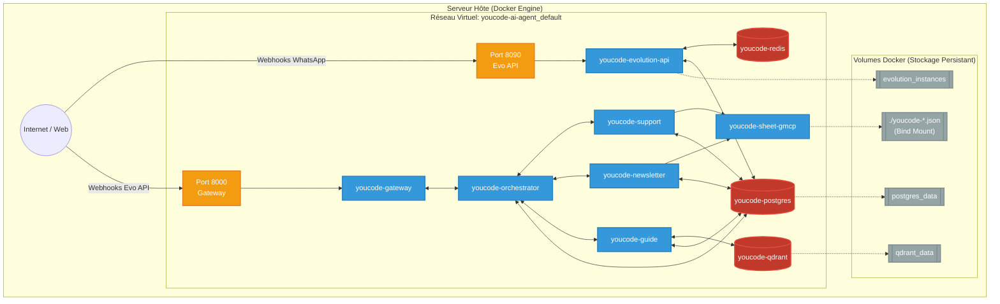

# 4.2 Diagramme de Déploiement (Infrastructure)

Ce diagramme décrit l'infrastructure physique du projet sur le serveur, telle que définie dans le fichier `compose.yaml`. Il montre les réseaux isolés, le mappage des ports, l'utilisation des volumes virtuels Docker, et surtout **toutes les dépendances correctes à la base Postgres** (utilisée par tous les agents comme Checkpointer).

> [!TIP]
> **Comment l'utiliser dans Eraser.io :**
> Importez ce code Mermaid directement dans Eraser ou donnez-le à l'IA d'Eraser pour qu'elle le transforme en vue architecturale détaillée.

