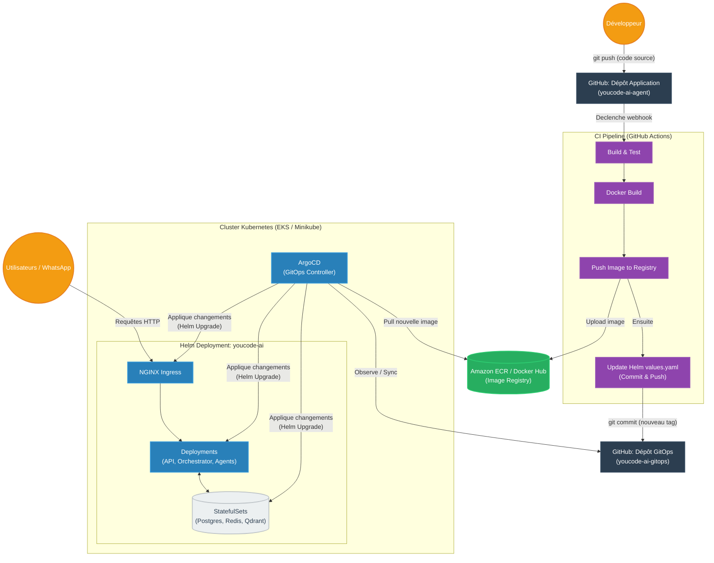

# 5. Diagramme DevOps & GitOps (CI/CD)

Ce diagramme illustre le flux de travail complet de l'Intégration Continue (CI) et du Déploiement Continu (CD) basé sur **GitOps**. Il montre comment le code source passe du dépôt GitHub au cluster Kubernetes via GitHub Actions, Amazon ECR et ArgoCD.

> [!TIP]
> **Comment l'utiliser dans Eraser.io :**
> Importez ce code Mermaid directement dans Eraser ou donnez-le à l'IA d'Eraser pour qu'elle le transforme en vue architecturale détaillée.

