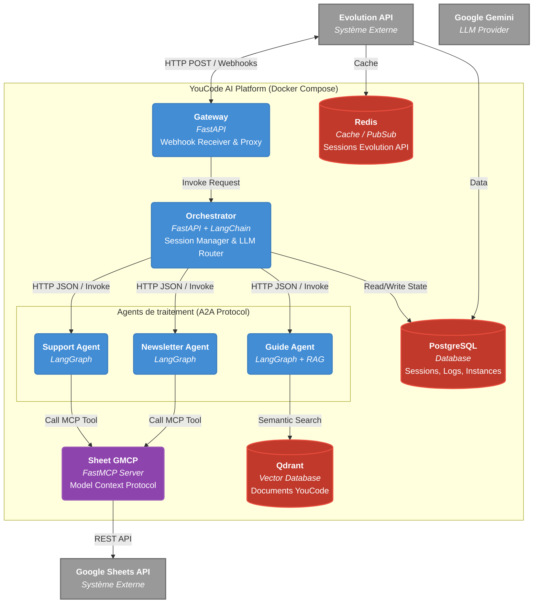

# 1.2 Container Diagram (Niveau 2)

Ce diagramme plonge à l'intérieur du système "YouCode AI Platform". Il montre les différents conteneurs (Microservices), la façon dont le trafic circule, et les bases de données attachées à chaque service.

> [!TIP]
> **Comment l'utiliser dans Eraser.io :**
> Importez ce code Mermaid directement dans Eraser ou donnez-le à l'IA d'Eraser pour qu'elle le transforme en vue architecturale détaillée.

