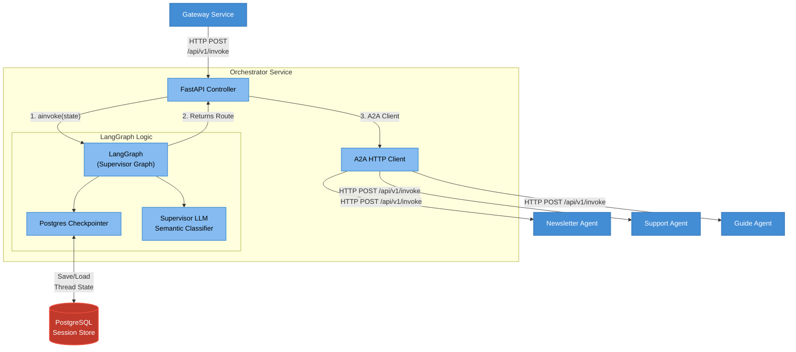

# 1.3 Component Diagram (Niveau 3 - Zoom sur l'Orchestrateur)

Ce diagramme corrige l'architecture interne de **l'Orchestrateur**. Il explique comment les messages sont reçus par le contrôleur FastAPI, envoyés au graphe LangGraph de l'orchestrateur (Supervisor), puis relayés à l'agent final via le protocole A2A.

> [!TIP]
> **Comment l'utiliser dans Eraser.io :**
> Importez ce code Mermaid directement dans Eraser ou donnez-le à l'IA d'Eraser pour qu'elle le transforme en vue architecturale détaillée.

