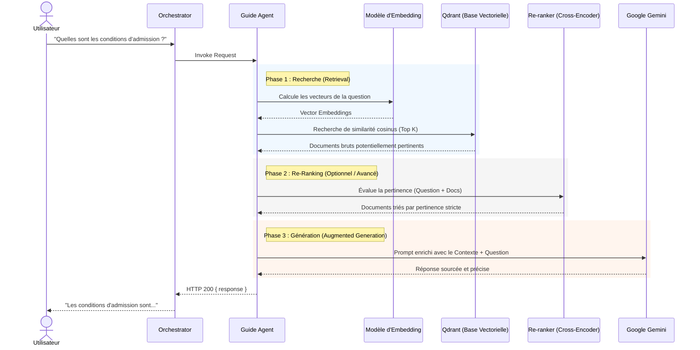

# 2.1 Flux de l'Agent Guide (RAG)

Ce diagramme de séquence illustre le fonctionnement du flux RAG (Retrieval-Augmented Generation) utilisé par le **Guide Agent**. Il montre comment les questions des utilisateurs sont enrichies par le contexte des documents internes de YouCode stockés dans la base vectorielle.

> [!TIP]
> **Comment l'utiliser dans Eraser.io :**
> Importez ce code Mermaid directement dans Eraser ou donnez-le à l'IA d'Eraser pour qu'elle le transforme en vue architecturale détaillée.

