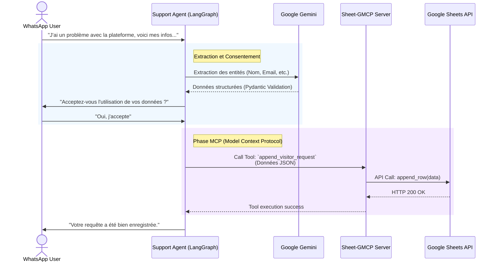

# 2.2 Flux de l'Agent Support & Intégration MCP

Ce diagramme de séquence illustre comment l'Agent Support utilise le Model Context Protocol (MCP) pour externaliser la persistance des données. Au lieu de se connecter directement à une base de données, l'Agent demande à un serveur MCP d'exécuter l'action sur Google Sheets.

> [!TIP]
> **Comment l'utiliser dans Eraser.io :**
> Importez ce code Mermaid directement dans Eraser ou donnez-le à l'IA d'Eraser pour qu'elle le transforme en vue architecturale détaillée.

