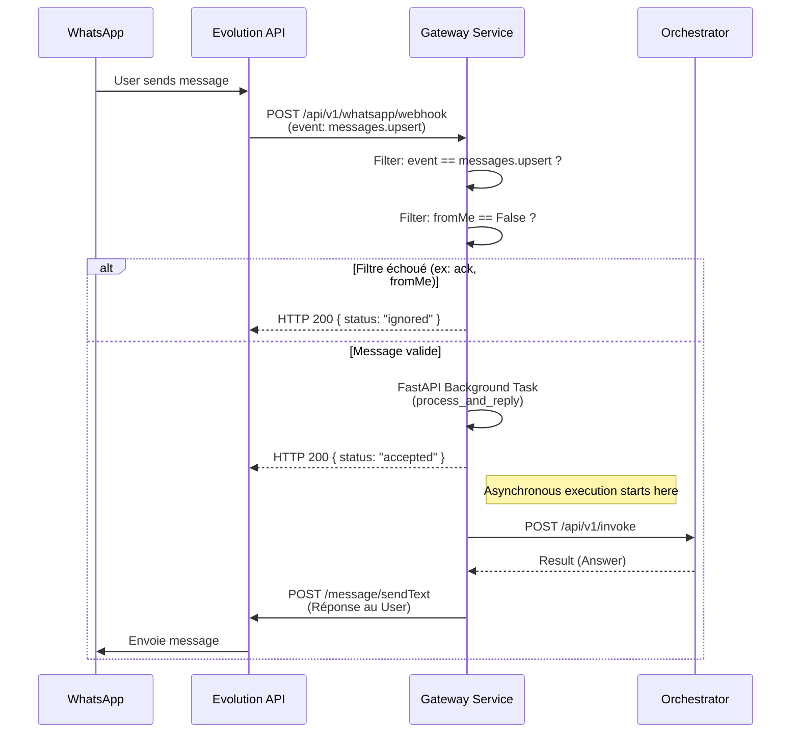

# 2.3 Gestion du Webhook & File d'attente (Gateway)

Ce diagramme de séquence montre le rôle du Gateway. Son but est d'intercepter les requêtes WhatsApp, de filtrer les bruits de fond (les messages envoyés par nous-mêmes), et de lancer les appels à l'Orchestrateur de manière asynchrone (Background Tasks) pour retourner rapidement un statut 200 OK à Evolution API et éviter les timeouts.

> [!TIP]
> **Comment l'utiliser dans Eraser.io :**
> Importez ce code Mermaid directement dans Eraser ou donnez-le à l'IA d'Eraser pour qu'elle le transforme en vue architecturale détaillée.

