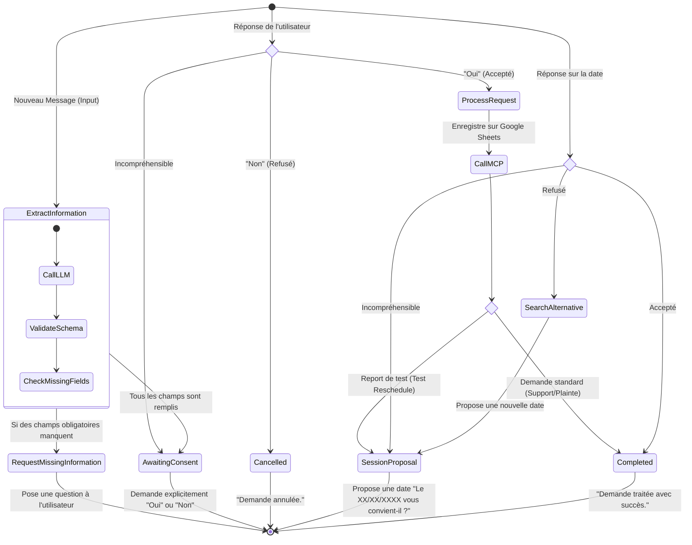

# 3.1 Machine d'État (Agent Support)

Ce diagramme d'état (State Machine) explique le comportement de l'Agent Support propulsé par **LangGraph**. Il met en évidence le parcours cyclique de la conversation, de la collecte des informations manquantes, jusqu'à la demande de consentement et la proposition d'une nouvelle session de test (dans le cas d'un report).

> [!TIP]
> **Comment l'utiliser dans Eraser.io :**
> Importez ce code Mermaid directement dans Eraser ou donnez-le à l'IA d'Eraser pour qu'elle le transforme en vue architecturale détaillée.

