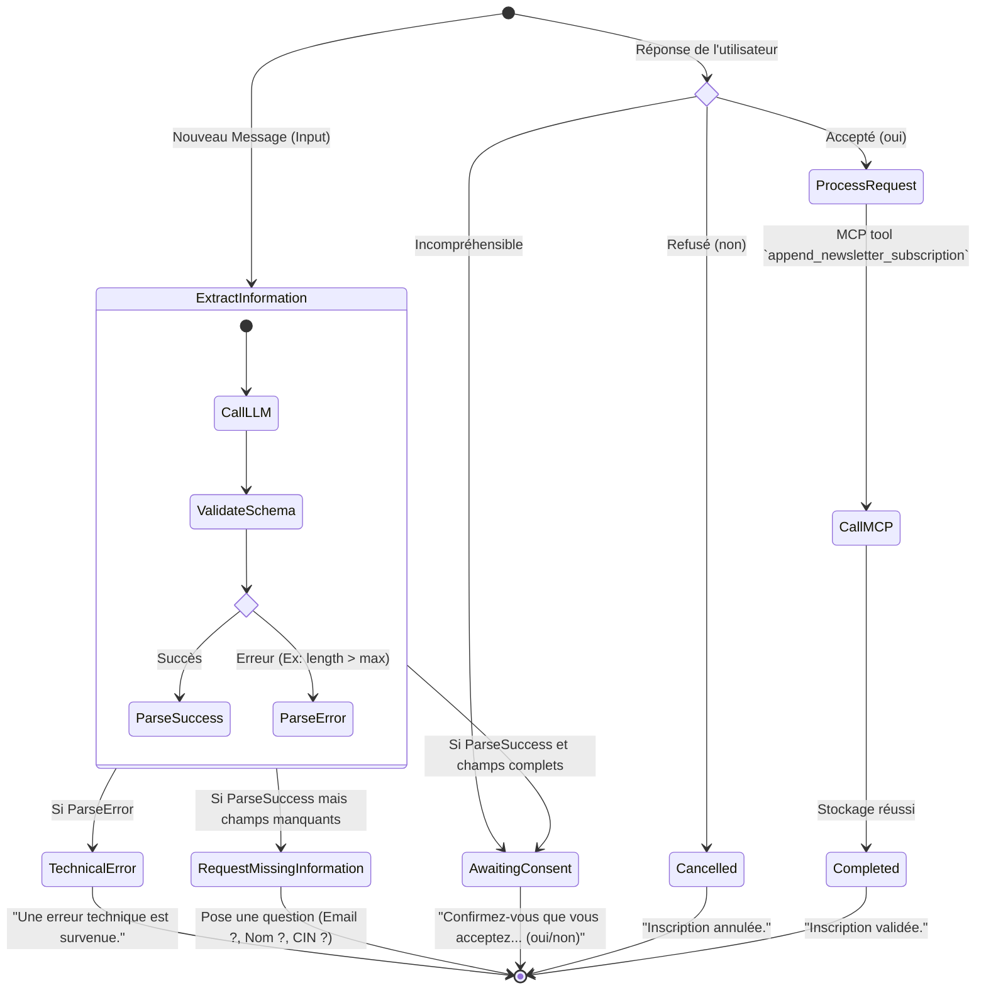

# 3.2 Machine d'État (Agent Newsletter)

Ce diagramme d'état (State Machine) montre le flux de l'Agent Newsletter avec **LangGraph**. Il illustre comment le système extrait les préférences de la newsletter (S'abonner / Se désabonner), gère les cas d'erreur de validation (Pydantic), et pousse le résultat vers Google Sheets via MCP.

> [!TIP]
> **Comment l'utiliser dans Eraser.io :**
> Importez ce code Mermaid directement dans Eraser ou donnez-le à l'IA d'Eraser pour qu'elle le transforme en vue architecturale détaillée.

