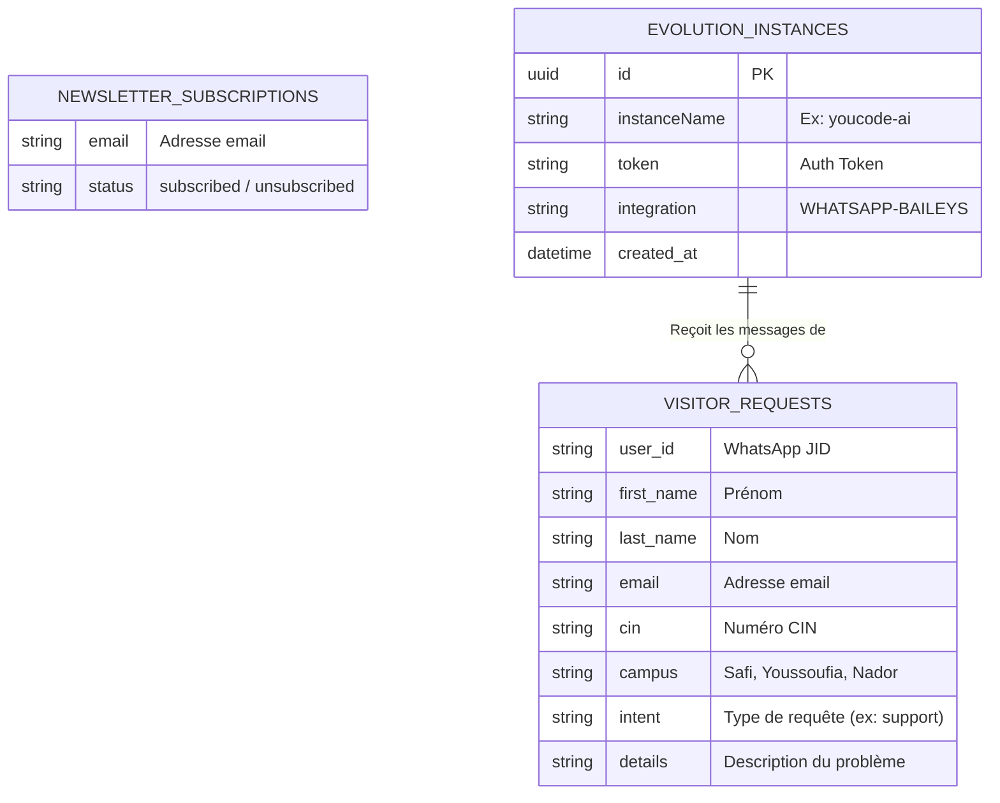

# 4.1 Modèle de Données (ERD)

Ce diagramme Entité-Association (Entity-Relationship Diagram) illustre la persistance des données. 
Avec le passage au Model Context Protocol (MCP), les requêtes utilisateurs ne sont plus stockées dans PostgreSQL, mais directement ajoutées en tant que lignes dans **Google Sheets**. La base de données PostgreSQL reste utilisée par l'API Evolution pour ses propres instances.

> [!TIP]
> **Comment l'utiliser dans Eraser.io :**
> Importez ce code Mermaid directement dans Eraser ou donnez-le à l'IA d'Eraser pour qu'elle le transforme en vue architecturale détaillée.

