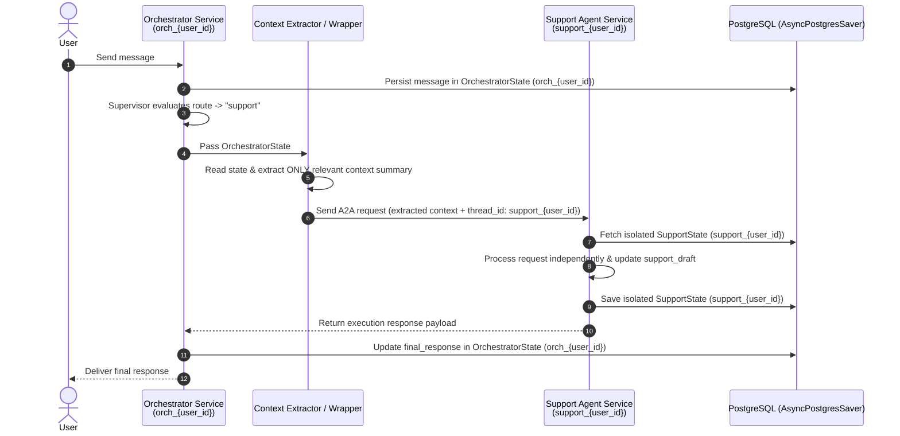

# State Management Strategy: Microservice State Isolation

## Overview
This document outlines the architectural strategy for migrating the YouCode AI Agent system from a monolithic shared state model (`YouCodeState`) to an isolated, microservice-oriented state model.

---

## 1. Current State (Monolithic Architecture)

Currently, the system relies on a single monolithic `YouCodeState` `TypedDict` shared across all agents and routing stages within a single unified graph.

### Monolithic `YouCodeState` Structure
The monolithic state aggregates all fields across conversation management, support ticket processing, and newsletter subscription workflows into one global object:

- **Global Conversation Metadata:**
  - `messages`: Complete message history.
  - `session_id`: Global session identifier.
  - `route`: Supervisor routing decision (`guide`, `support`, `newsletter`, `clarification`, `out_of_scope`).
  - `active_agent`: Currently active agent node (`guide`, `support`, `newsletter`).
  - `final_response`: Response object delivered to the user.
  - `requires_human`: Flag indicating human escalation required.
- **Support Workflow State:**
  - `support_phase`: Workflow stage (`collecting`, `awaiting_consent`, `processing`, `awaiting_session_confirmation`, `confirming_session`, `searching_alternative`, `completed`, `cancelled`).
  - `support_draft`: Dictionary containing collected ticket details:
    - `request_type`: Type of support request.
    - `language`: Conversation language (`fr`, `en`, `ar`, `darija`).
    - `email`: User email.
    - `phone_number`: User phone number.
    - `full_name`: User full name.
    - `cin`: User National Identification Number (CIN).
    - `campus`: Associated campus location.
    - `scheduled_test_date`: Existing scheduled test date (ISO format).
    - `requested_test_date`: Requested new test date (ISO format).
    - `description`: Support request summary/description.
    - `ambiguities`: Unresolved items requiring clarification.
  - `proposed_session_id`: ID of a proposed rescheduled session.
  - `proposed_test_date`: Date/time of proposed session.
  - `rejected_session_ids`: List of session IDs rejected by the user.
  - `consent_confirmed`: Boolean flag confirming explicit user consent for SQL operations.
  - `request_reference`: Reference ID after persistent SQL insertion.
- **Newsletter Workflow State:**
  - `newsletter_phase`: Workflow stage (`collecting`, `awaiting_consent`, `processing`, `completed`, `cancelled`).
  - `newsletter_draft`: Dictionary containing subscription details:
    - `action`: Subscription action (`subscribe`, `unsubscribe`, `unknown`).
    - `language`: Selected communication language.
    - `email`: Target subscriber email.
    - `phone_number`: Target subscriber phone.
    - `full_name`: Subscriber name.
    - `cin`: Subscriber CIN.
    - `topics`: List of chosen topics (`full_program_registration`, `bootcamps`, `events`, `youcode_news`).
    - `ambiguities`: List of ambiguous subscription fields.
  - `newsletter_consent_confirmed`: Boolean flag confirming consent for newsletter registration.
  - `subscription_reference`: Reference ID after SQL record creation.

### Architectural Shortcomings of Monolithic State

1. **Data Leakage & Privacy Violations (PII Concerns)**
   - Sensitive user information (e.g., CIN, phone number, personal email collected during a Support ticket request) persists in the global state object.
   - Non-sensitive agents (such as the Guide Agent answering public FAQs) receive the entire state payload. This introduces security and privacy vulnerabilities under regulations like GDPR, as components gain access to sensitive personal data unnecessary for their function.

2. **Debugging & Traceability Complexity**
   - Any agent node in the monolithic graph can read and mutate any state key.
   - Identifying which node modified a specific field (e.g., unexpected overwrites of `support_draft` or `newsletter_draft`) becomes difficult during debugging. State transitions are tightly entangled across unrelated domain models.

3. **Tight Coupling & Monolithic Deployment Bottlenecks**
   - All microservices must import and share the exact same Python definition of `YouCodeState`.
   - Modifying a domain field in the Support workflow forces schema updates and re-deployments across all other services (Guide, Newsletter, Orchestrator).
   - This prevents independent scaling, modular maintenance, and isolated service deployment.

---

## 2. Target State (Isolated Microservice State)

In the target architecture, each agent microservice maintains its own dedicated, strictly scoped `TypedDict` state. Agents only store and process data pertinent to their specific domain responsibility.

### Full Python TypedDict Code Definitions

```python
from typing import Annotated, Literal, TypedDict
from langchain_core.messages import BaseMessage
from langgraph.graph.message import add_messages

# -----------------------------------------------------------------------------
# Draft Definitions
# -----------------------------------------------------------------------------

class SupportDraft(TypedDict, total=False):
    """Informations temporairement collectées pour une demande de support."""
    request_type: str
    language: Literal["fr", "en", "ar", "darija"]
    email: str
    phone_number: str
    full_name: str
    cin: str
    campus: str
    scheduled_test_date: str  # Format ISO: YYYY-MM-DD
    requested_test_date: str  # Format ISO: YYYY-MM-DD
    description: str
    ambiguities: list[str]


class NewsletterDraft(TypedDict, total=False):
    """Informations Newsletter collectées avant l'enregistrement SQL."""
    action: Literal["subscribe", "unsubscribe", "unknown"]
    language: Literal["fr", "en", "ar", "darija"]
    email: str
    phone_number: str
    full_name: str
    cin: str
    topics: list[
        Literal[
            "full_program_registration",
            "bootcamps",
            "events",
            "youcode_news",
        ]
    ]
    ambiguities: list[str]


# -----------------------------------------------------------------------------
# Microservice State Definitions
# -----------------------------------------------------------------------------

class OrchestratorState(TypedDict, total=False):
    """State maintained exclusively by the Orchestrator service."""
    messages: Annotated[list[BaseMessage], add_messages]
    session_id: str
    user_id: str
    route: Literal[
        "guide",
        "support",
        "newsletter",
        "clarification",
        "out_of_scope",
    ]
    active_agent: Literal["guide", "support", "newsletter"] | None
    final_response: dict | None
    requires_human: bool


class GuideState(TypedDict, total=False):
    """State maintained exclusively by the Guide Agent microservice."""
    messages: Annotated[list[BaseMessage], add_messages]
    session_id: str


class SupportState(TypedDict, total=False):
    """State maintained exclusively by the Support Agent microservice."""
    messages: Annotated[list[BaseMessage], add_messages]
    session_id: str
    support_phase: Literal[
        "collecting",
        "awaiting_consent",
        "processing",
        "awaiting_session_confirmation",
        "confirming_session",
        "searching_alternative",
        "completed",
        "cancelled",
    ]
    support_draft: SupportDraft
    consent_confirmed: bool
    proposed_session_id: str | None
    proposed_test_date: str | None
    rejected_session_ids: list[str]
    request_reference: str | None


class NewsletterState(TypedDict, total=False):
    """State maintained exclusively by the Newsletter Agent microservice."""
    messages: Annotated[list[BaseMessage], add_messages]
    session_id: str
    newsletter_phase: Literal[
        "collecting",
        "awaiting_consent",
        "processing",
        "completed",
        "cancelled",
    ]
    newsletter_draft: NewsletterDraft
    newsletter_consent_confirmed: bool
    subscription_reference: str | None
```

---

## 3. Thread ID Naming Convention

To guarantee state isolation within the database persistence layer while preserving deterministic session tracking per user across services, a structured Thread ID naming convention is enforced.

| Service | Thread ID Pattern | Example | Description / Scope |
| :--- | :--- | :--- | :--- |
| **Orchestrator** | `orch_{user_id}` | `orch_abc123` | Top-level conversation session and global routing history |
| **Guide** | `guide_{user_id}` | `guide_abc123` | Q&A session state for general info & curriculum guidance |
| **Support** | `support_{user_id}` | `support_abc123` | Isolated state for support ticket generation and rescheduling |
| **Newsletter** | `newsletter_{user_id}` | `newsletter_abc123` | Isolated state for newsletter preferences and subscriptions |

---

## 4. Context Transfer & The Wrapper Pattern

Communication between the Orchestrator and downstream agent microservices follows the **Wrapper / Context Extractor Pattern**. This pattern ensures that target microservices receive only sanitized, relevant context without exposing foreign domain state or Orchestrator internal fields.

### Execution Workflow

1. **User Message Ingestion:** The Orchestrator receives an incoming message from the user and appends it to its state under `orch_{user_id}`.
2. **Supervisor Routing:** The Orchestrator Supervisor evaluates the intent and determines the target route (e.g., `"support"`).
3. **Context Extraction:** The Context Extractor reads `OrchestratorState`, extracts ONLY relevant conversation history and summary data, filtering out unneeded fields.
4. **Wrapper Execution (A2A Request):** The Wrapper packages the extracted payload and transmits an Agent-to-Agent (A2A) request to the Support service using the isolated thread ID `support_{user_id}`.
5. **Isolated Processing:** The Support Agent processes the request independently using its own state (`SupportState` saved under `support_{user_id}`).
6. **Response Synchronization:** The Support Agent returns its response payload back to the Orchestrator. The Orchestrator updates `OrchestratorState` and relays the final output to the user.

### Sequence Diagram



---

## 5. Data Isolation Rules Matrix

The following matrix defines data visibility permissions for each agent microservice:

| Data Attribute / State Key | Guide Agent | Support Agent | Newsletter Agent |
| :--- | :--- | :--- | :--- |
| **Conversation Messages** | ✅ **CAN** see | ✅ **CAN** see | ✅ **CAN** see |
| **Extracted Context Summary** | ✅ **CAN** see | ✅ **CAN** see | ✅ **CAN** see |
| **CIN (National ID)** | ❌ **CANNOT** see | ✅ **CAN** see (in `support_draft`) | ❌ **CANNOT** see (unless in `newsletter_draft`) |
| **Phone Number & Personal Email** | ❌ **CANNOT** see | ✅ **CAN** see (in `support_draft`) | ❌ **CANNOT** see (unless in `newsletter_draft`) |
| **Support Draft & Support Phase** | ❌ **CANNOT** see | ✅ **CAN** see | ❌ **CANNOT** see |
| **Newsletter Draft & Newsletter Phase** | ❌ **CANNOT** see | ❌ **CANNOT** see | ✅ **CAN** see |

---

## 6. PostgreSQL State Persistence Architecture

All agent microservices leverage `AsyncPostgresSaver` for persistence. State isolation is guaranteed at the storage level:

- **Shared Database Instance:** All microservices connect to the same underlying PostgreSQL instance hosting standard LangGraph checkpointer tables (`checkpoints`, `checkpoint_writes`, `checkpoint_blobs`).
- **Logical Partitioning via Thread IDs:** Logical state separation between microservices is enforced by prefixing Thread IDs per domain service (`orch_{user_id}`, `guide_{user_id}`, `support_{user_id}`, `newsletter_{user_id}`).
- **Zero Cross-Contamination:** When the Support service writes to `support_{user_id}`, it accesses checkpoint records isolated from `newsletter_{user_id}` or `guide_{user_id}`.
- **Independent Scaling & Reliability:** Microservices can scale horizontally and execute concurrent checkpoints without concurrency conflicts or state corruption across service boundaries.
