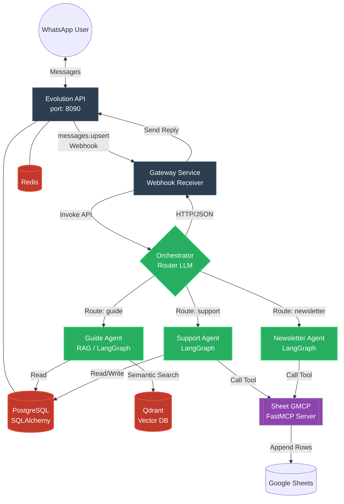
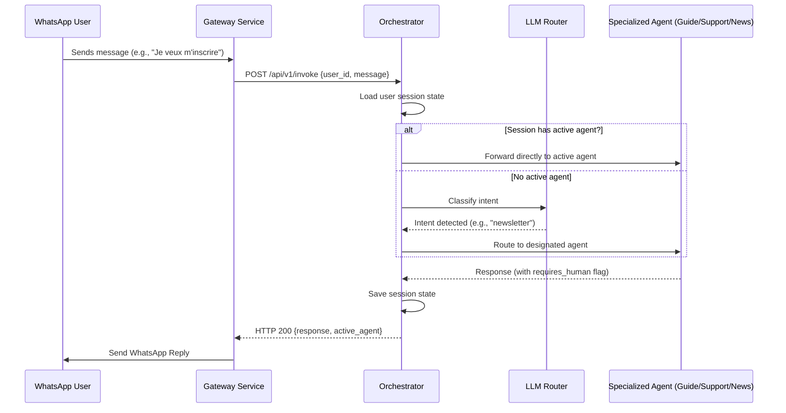
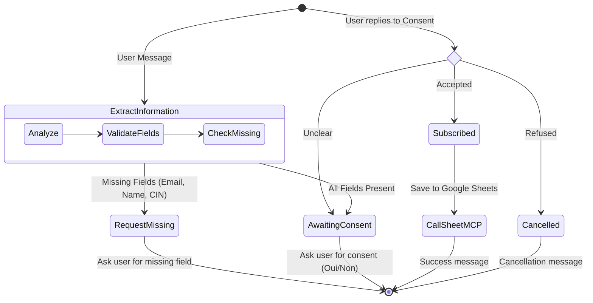
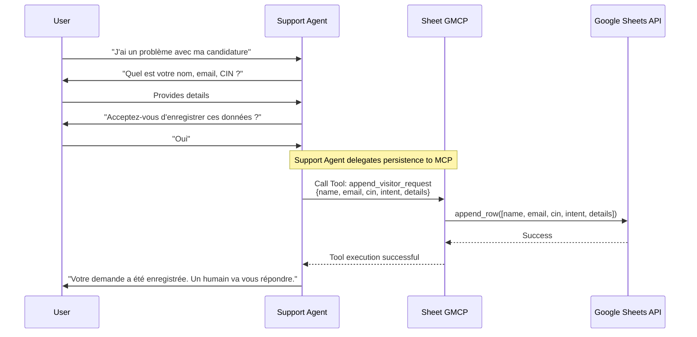

# YouCode AI Platform - System Architecture & Workflows

Here are the diagrams that explain the inner workings of your application. These diagrams use Mermaid.js and are rendered natively.

## 1. High-Level System Architecture
This diagram shows how all the microservices, external APIs, and databases communicate with each other.

---

## 2. Orchestrator Routing Flow
This demonstrates how a user's incoming message is classified and routed to the correct autonomous agent.

---

## 3. Newsletter Agent State Machine (LangGraph)
This diagram illustrates the step-by-step logic the Newsletter Agent uses to gather information, ask for consent, and save data to Google Sheets via MCP.

---

## 4. Support Request Flow with MCP
This flow shows the integration between the Support agent and the `sheet-gmcp` server to persist data without direct database access.

